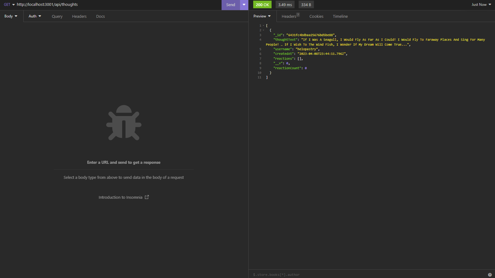
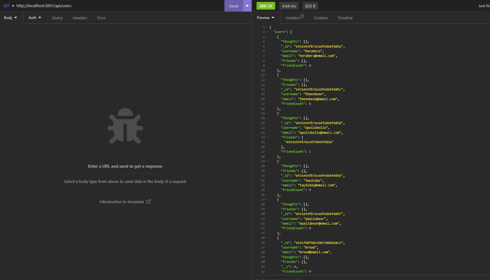

# social-network-api

## Table of Contents 

- [Description](#description)
- [Usage](#usage)
- [Contributors](#contributors)
- [License](#license)
- [Questions](#questions)

## Description
An API for a social network web application where users can share their thoughts, react to friends' thoughts, and create a friend list. Express.js is used for routing, MongoDB for the database, and Mongoose ODM.

## Usage
Watch the video demonstration [here](https://drive.google.com/file/d/1r30KAmqbEg1AunF3f3nHhrbS4hHEQPrY/view)

 
 
   

## Contributors
Brenn Voyles

## License
[MIT License](https://spdx.org/licenses/MIT.html)

Permission is hereby granted, free of charge, to any person obtaining a copy
of this software and associated documentation files (the "Software"), to deal
in the Software without restriction, including without limitation the rights
to use, copy, modify, merge, publish, distribute, sublicense, and/or sell
copies of the Software, and to permit persons to whom the Software is
furnished to do so.

## Questions 
If there are any additional questions, feel free to reach out by email or github.

Email: [brennaveir@hotmail.com](mailto:brennaveir@hotmail.com)

Github: [brennaveir](https://github.com/brennaveir)

https://drive.google.com/file/d/1r30KAmqbEg1AunF3f3nHhrbS4hHEQPrY/view